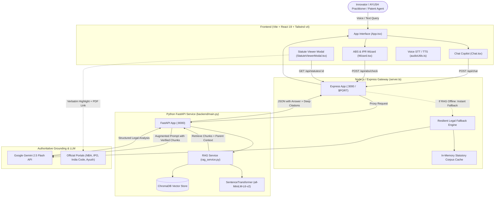

# 🌿 IP-SAKTI Sahayak (v4.0)

> **AI-Powered Statutory Intellectual Property, Regulatory & ABS Compliance Copilot for AYUSH Innovations**  
> *Developed for Researchers, Innovators, Startups, and Regulators in the Indian Systems of Medicine.*

[](https://nodejs.org)
[](https://python.org)
[](https://fastapi.tiangolo.com)
[](https://react.dev)
[](https://vitejs.dev)
[](https://www.trychroma.com)
[](https://deepmind.google/technologies/gemini/)
[](https://railway.com)

---

## 📌 Executive Summary

**IP-SAKTI Sahayak** is a specialized, production-ready legal AI copilot designed to bridge the regulatory and intellectual property divide for India's traditional knowledge and AYUSH sectors (*Ayurveda, Yoga & Naturopathy, Unani, Siddha, Sowa-Rigpa, and Homoeopathy*).

Patenting and commercializing AYUSH innovations in India requires navigating an intricate intersection of three distinct statutory frameworks:
1. **The Biological Diversity Act, 2002** (and the landmark **Biological Diversity (Amendment) Act, 2023**)
2. **The Indian Patents Act, 1970** (specifically Sections 3(p), 3(d), 3(e), and NBA clearance requirements under Section 6)
3. **The Drugs & Cosmetics Act, 1940 & Rules, 1945** (specifically Rule 158B for Ayurvedic/Siddha/Unani drug licensing)

IP-SAKTI Sahayak implements **Parent-Child Statutory Retrieval-Augmented Generation (RAG)** grounded entirely on official Government of India Gazette records, ensuring **zero hallucinations**, verified statutory provisions, yellow verbatim highlighted text citations, and direct links to authentic government gazette PDFs.

---

## 🏛️ Statutory Scope & Legal Grounding

Every recommendation, assessment, and citation generated by IP-SAKTI Sahayak is validated against authentic government publications from 4 verified statutory domains:
- **`nbaindia.org` / `nbaindia.nic.in`** — National Biodiversity Authority (NBA)
- **`ipindia.gov.in`** — Intellectual Property India / Indian Patent Office (IPO)
- **`indiacode.gov.in`** — India Code Legislative Department
- **`ayush.gov.in`** — Ministry of Ayush, Government of India

### Key Statutory Provisions Covered

| Statutory Instrument | Section / Provision | Subject Matter & Legal Effect |
| :--- | :--- | :--- |
| **Biological Diversity Act, 2002** | **Section 3** | Regulation of access to biological resources by foreign entities, NRIs, and foreign-controlled entities (Mandatory NBA Approval). |
| **Biological Diversity Act, 2002** | **Section 6** | Mandatory prior approval of NBA (**Form III**) before grant of any patent or IPR based on Indian biological resources or traditional knowledge. |
| **BD (Amendment) Act, 2023** | **Section 7** | Prior intimation to State Biodiversity Boards (SBB). **Statutory Exemption**: Explicitly exempts registered AYUSH practitioners, vaids, hakims, local communities, and cultivated medicinal plants (with Certificate of Origin). |
| **Biological Diversity Act, 2002** | **Section 40** | **Normally Traded Commodities (NTC)**: Central Government notification exempting ~421 commercial agricultural/botanical items from BDA provisions. |
| **NBA Regulations** | **Forms I, II, III & IV** | Application workflows for Access (Form I), Transfer of Results (Form II), IPR Application (Form III), and Third-party Commercial Transfer (Form IV). |
| **Indian Patents Act, 1970** | **Section 3(p)** | Non-patentability of inventions which in effect are traditional knowledge or aggregations/duplications of known properties of components. |
| **Indian Patents Act, 1970** | **Section 3(d)** | Non-patentability of mere discovery of new forms of known substances without proven significant **enhancement of therapeutic efficacy**. |
| **Indian Patents Act, 1970** | **Section 3(e)** | Non-patentability of substances obtained by a mere admixture resulting only in aggregation of properties. |
| **Drugs & Cosmetics Rules, 1945**| **Rule 158B** | Regulatory evidence thresholds for grant of license to manufacture Ayurvedic, Siddha, or Unani drugs (Classical textual proof vs. Proprietary clinical safety data). |

---

## ⚡ Core Capabilities & Features

### 1. Parent-Child Statutory RAG
- **Substantive Parent Context**: Splits statutory texts into granular child chunks for dense vector embedding while preserving the complete, unabridged legislative section ("Parent Document") for reader inspection.
- **Hybrid Retrieval**: Combines semantic embeddings (SentenceTransformers `all-MiniLM-L6-v2`) with lexical BM25 keyword matching for exact section numbering and term matching.
- **Confidence Scoring & Abstention**: Queries scoring below the statutory relevance threshold trigger explicit abstention or human escalation alerts rather than generating speculative answers.

### 2. Live In-App Statutory Viewer Modal
- Instant, non-intrusive preview of legislative sections when clicking **"Read Extracted Section"** on any citation card.
- **Exact Verbatim Highlighting**: The specific clause or subsection retrieved by the RAG engine is highlighted in high-contrast yellow directly inside the full statutory provision.
- **Direct Official Gazette Link**: Each card provides a one-click button to open the authentic Government of India PDF or India Code portal page.
- **Built-in Static Legal Fallback**: If the network is restricted or the backend is warming up, the viewer seamlessly resolves provisions from a compiled statutory dictionary.

### 3. Interactive ABS & IPR Compliance Wizard
- Guided multi-step question flow evaluating applicant entity type (Indian citizen, foreign entity, startup, MSME).
- Analyzes biological resource origin (wild forest produce, cultivated species, normally traded commodity).
- Formulates exact procedural roadmaps: Form I vs. Form III vs. SBB Intimation vs. Rule 158B licensing route.

### 4. AYUSH Patentability & TKDL Prior Art Assessor
- Evaluates proposed formulations against Traditional Knowledge Digital Library (TKDL) references.
- Identifies Section 3(p) aggregation risks and suggests patent claim drafting strategies (e.g., synergistic extraction processes, novel drug delivery systems, nano-emulsions, specific bioavailability-enhancing fractions).
- Assesses Section 3(d) enhancement of efficacy criteria with recommended comparative pharmacological data requirements.

### 5. Multilingual Voice-Enabled Interface
- Full accessibility across Indian regional languages including Hindi, Tamil, Telugu, Kannada, Bengali, Marathi, Gujarati, and English.
- Real-time Speech-to-Text (voice query input) and Text-to-Speech (audio playback of regulatory findings) powered by Web Speech API.

### 6. One-Click Compliance Dossier Export
- Generates publication-grade compliance audits and patentability review summaries.
- One-click export to print-ready PDF reports with timestamps, verified citations, and ABS checklists.

---

## 🏗️ System Architecture



---

## 📂 Project Directory Structure

```
IP-SAKTI-Sahayak_v3-main/
│
├── run_all.bat                           # Root one-click launcher for Windows
├── README.md                             # Comprehensive project documentation
│
└── Ayush-IP-v2-main/                     # Core application directory
    ├── package.json                      # Node dependencies & build scripts
    ├── tsconfig.json                     # TypeScript compiler configuration
    ├── vite.config.ts                    # Vite build configuration (with allowedHosts)
    ├── nixpacks.toml                     # Nixpacks container specification for Railway
    ├── requirements.txt                  # Python dependencies (FastAPI, ChromaDB, etc.)
    ├── .env.example                      # Environment variables reference template
    ├── run_all.bat                       # Local batch launcher (Port 8000 + 3000)
    ├── server.ts                         # Node.js / Express gateway & resilient fallback
    │
    ├── src/                              # React frontend source
    │   ├── App.tsx                       # Main application layout & state
    │   ├── main.tsx                      # React DOM root entry
    │   ├── types.ts                      # Shared TypeScript models & citation schemas
    │   ├── components/
    │   │   ├── Chat.tsx                  # Core conversational AI interface
    │   │   ├── Wizard.tsx                # Guided ABS & Patentability workflow wizard
    │   │   ├── StatuteViewerModal.tsx    # In-app statute reader with verbatim highlights
    │   │   ├── CitationsDrawer.tsx       # Expandable citation references panel
    │   │   ├── AbsChecklistModal.tsx     # Biological Diversity Act compliance audit checklist
    │   │   ├── TopNavbar.tsx             # Navigation header with language & mode controls
    │   │   ├── VoiceModal.tsx            # Voice input and audio status indicator
    │   │   └── AyushLogo.tsx             # AYUSH Government of India insignia badge
    │   └── lib/
    │       ├── citationUtils.ts          # Citation normalization & verification rules
    │       ├── audioUtils.ts             # Web Speech API voice synthesis & recognition
    │       ├── exportUtils.ts            # PDF report exporter using jsPDF & html2canvas
    │       ├── guardrails.ts             # Input/Output legal guardrail rules
    │       └── utils.ts                  # Tailwind class merge & UI helpers
    │
    ├── backend/                          # Python FastAPI backend
    │   ├── main.py                       # FastAPI entry point & API endpoints
    │   ├── rag_service.py                # ChromaDB vector retrieval & Gemini pipeline
    │   └── legal_corpus.py               # Statutory corpus loaders & schemas
    │
    ├── data/                             # Grounded statutory data
    │   ├── corpus/
    │   │   ├── corpus_data.json          # Curated Parent-Child legal corpus
    │   │   └── known_gaps.json           # Known gaps & excluded records registry
    │   └── chroma_db/                    # Persistent vector database store
    │
    └── scripts/                          # Pipelines and tools
        ├── ingest.py                     # Data ingestion and chunking pipeline
        └── playwright_url_resolver.py    # Playwright browser scraper for India Code
```

---

## 🚀 Quickstart & Installation

### Prerequisites
- **Node.js**: `v20.x` or higher
- **Python**: `v3.11.x` (recommended)
- **Git**: Installed and on system PATH
- **Google Gemini API Key**: Obtain a key from [Google AI Studio](https://aistudio.google.com/)

---

### Step 1: Clone the Repository
```bash
git clone https://github.com/Dev8-Siddharth/IP-SAKTI-Sahayak_v4.git
cd IP-SAKTI-Sahayak_v4/Ayush-IP-v2-main
```

---

### Step 2: Configure Environment Variables
Copy `.env.example` to `.env`:
```bash
cp .env.example .env
```
Edit `.env` and insert your Gemini API Key:
```env
# Google Gemini API Configuration
GEMINI_API_KEY="AIzaSyYourGeminiApiKeyHere"
GEMINI_MODEL=gemini-2.5-flash

# ChromaDB & Corpus Paths
CHROMA_PERSIST_DIR=./data/chroma_db
CORPUS_DATA_PATH=./data/corpus/corpus_data.json
EMBEDDING_MODEL_NAME=sentence-transformers/all-MiniLM-L6-v2
RETRIEVAL_CONFIDENCE_THRESHOLD=0.35

# Network Configuration
HOST=127.0.0.1
PORT=8000
VITE_PORT=3000
RAG_BACKEND_URL=http://127.0.0.1:8000
```

---

### Step 3: Install Dependencies

#### Frontend & Gateway (Node.js)
```bash
npm install
```

#### Backend (Python)
It is recommended to use a virtual environment:
```bash
python -m venv .venv

# On Windows:
.venv\Scripts\activate

# On Linux / macOS:
source .venv/bin/activate

pip install -r requirements.txt
```

---

### Step 4: Run the Application

#### Option A: One-Click Windows Launcher
Double-click `run_all.bat` in the root folder or run:
```cmd
run_all.bat
```
This automatically starts:
- Python FastAPI RAG backend on `http://127.0.0.1:8000`
- React / Express Frontend Gateway on `http://localhost:3000`

#### Option B: Manual Startup

**Terminal 1 — Backend:**
```bash
python backend/main.py
```
*(Backend verifies ChromaDB and starts on `http://127.0.0.1:8000`)*

**Terminal 2 — Frontend:**
```bash
npm run dev
```
*(Frontend starts on `http://localhost:3000`)*

Open your browser and navigate to **`http://localhost:3000`**.

---

## 🚢 Deployment Guide (Railway / Cloud)

This repository includes a production-grade **`nixpacks.toml`** file designed for zero-config deployments on **[Railway](https://railway.com)** or any Nixpacks-based host.

### Railway Deployment Steps

1. **Push to GitHub**:
   Ensure your latest code is on GitHub.
2. **Create New Railway Project**:
   - Go to [Railway Dashboard](https://railway.app/dashboard).
   - Click **"New Project"** $\rightarrow$ **"Deploy from GitHub repo"**.
   - Select your repository (`IP-SAKTI-Sahayak_v4`).
3. **Configure Environment Variables in Railway**:
   Under your service's **Variables** tab, add:
   - `GEMINI_API_KEY`: Your Gemini API Key
   - `NODE_ENV`: `production`
4. **Networking**:
   - Railway injects `PORT` automatically.
   - The Express server dynamically binds to `0.0.0.0` and listens on `process.env.PORT`.
   - Click **"Generate Domain"** under **Public Networking** to access your public URL.

### Nixpacks Configuration Breakdown (`nixpacks.toml`)
```toml
providers = ["node"]

[phases.setup]
nixPkgs = ["nodejs_20", "python311", "python311Packages.pip", "gcc"]
nixLibs = ["gcc-unwrapped", "stdenv.cc.cc.lib"]

[phases.install]
cmds = [
  "npm install",
  "pip install --no-cache-dir --break-system-packages -r requirements.txt"
]

[phases.build]
cmds = ["npm run build"]

[start]
cmd = "npm start"

[variables]
NODE_ENV = "production"
LD_LIBRARY_PATH = "/root/.nix-profile/lib:/usr/lib:/usr/local/lib"
```

---

## 🔌 API Endpoints Reference

| Endpoint | Method | Description |
| :--- | :--- | :--- |
| `/api/chat` | `POST` | Core RAG Copilot query endpoint. Accepts query, history, and language. Returns structured markdown answer, verified citations, confidence metrics, and escalation flags. |
| `/api/statutes` | `GET` | Returns list of all substantive statutory parent provisions in the corpus. |
| `/api/statutes/:parent_id` | `GET` | Fetches the full unabridged statutory text and metadata for a specific parent record (e.g. `parent_bda_sec_7`). |
| `/api/abs/check` | `POST` | Processes entity and biological resource parameters through the Access and Benefit Sharing (ABS) decision tree. |
| `/api/health` | `GET` | Service liveness and readiness probe reporting gateway and vector engine status. |

---

## 🛡️ Statutory Integrity & Guardrails

To prevent misleading regulatory advice, IP-SAKTI Sahayak enforces 5 architectural guardrails:

1. **Anti-Hallucination Gate**: If retrieved statutory chunks have similarity scores below the strict threshold ($<0.35$), the copilot explicitly abstains from speculating and alerts the user that no direct statutory authority was found.
2. **Verbatim Text Anchoring**: Citations are only marked `VERIFIED` if their exact excerpt exists verbatim inside the authorized statutory corpus.
3. **Central vs. State Scope Filter**: Ingestion pipelines strictly distinguish between the Central Biological Diversity Act and state-specific biodiversity rules (e.g., Tamil Nadu, Chhattisgarh).
4. **Mandatory Disclaimer Notice**: Every response includes an explicit disclaimer reminding users that this tool provides academic and legal research assistance and does not constitute formal advocate-client advice.
5. **Human Escalation Indicator**: Complex queries involving criminal penalties (Section 55 BDA), international IP transfers (Form IV), or contentious biopiracy challenges automatically trigger a `"Needs Human Legal Escalation"` warning badge.

---

## ⚖️ Legal Disclaimer

> **IMPORTANT**:  
> **IP-SAKTI Sahayak** is an assistive legal and regulatory artificial intelligence research tool designed to assist innovators, researchers, patent agents, and regulatory teams in navigating the Indian AYUSH and Biodiversity regulatory landscape.  
> The information provided does **not** constitute formal legal counsel, statutory certification, or an official decision of the National Biodiversity Authority (NBA), the Indian Patent Office (CGPDTM), the State Biodiversity Boards (SBB), or the Ministry of Ayush. Users are advised to verify all filings with licensed legal advocates or registered patent agents before submission.

---

## 👨‍💻 Author & Maintainer

- **Developer**: Dev Siddharth
- **Repository**: [IP-SAKTI-Sahayak_v4](https://github.com/Dev8-Siddharth/IP-SAKTI-Sahayak_v4)
- **License**: MIT License (or as specified by project stakeholders)
